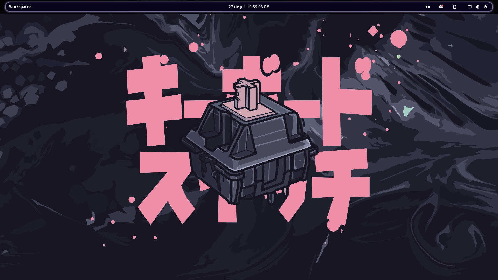

# ✨ Rice Catppuccin Style para Pop_OS Gnome

Un rice basado en el estilo Catppuccin Macchiato para Pop!_OS basado en GNOME, con tiling automático, configuración de terminal, neofetch personalizado, temas GTK y cursores.

> 📷 Capturas abajo | 🔧 Compatible con Pop!_OS 22.04+ | 💻 Requiere GNOME y pop-shell

---

## 📸 Capturas

  
*Escritorio personalizado con tiling automático y tema GTK.*

  
*Terminal kitty con neofetch, htop y cmatrix | Todos necesitan previa instalación.*

---

## 🧰 Características

- 🎨 Tema GTK personalizado con paleta ajustada para Pop!_OS  
- 🖱️ Cursor  para mejor visibilidad  
- 🖥️ Terminal `kitty` con fuente Hack Nerd Font y colores inspirados en Catppuccin Style  
- 📦 Neofetch con configuración personalizada

---

## 📁 Estructura del repositorio

```bash
.
├── .config/
│   ├── gtk-3.0/
│   ├── gtk-4.0/
│   ├── kitty/
│   ├── neofetch/
├── dconf/
│   └── gnome-interface.dconf
├── images/
│   ├── Messi_wac.png
│   ├── sushi.jpg
│   └── screenhots/
│   	├── Desktop.png
│   	├── Screen_Terminal.png
│   	└── Workspaces.png
└── README.md
